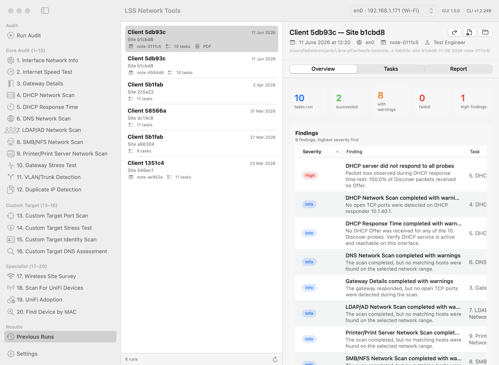

# LSS Network Tools — macOS app

A native SwiftUI front end (macOS 14+, Swift 6) for the `lss-network-tools` bash engine. The
bash script stays the engine: the app starts it in non-interactive mode, shows its progress
live, and browses the run directories it writes. Nothing is re-implemented in Swift.



## What it does

| Screen | What you get |
|---|---|
| **Run Audit / task screens** | "New Run…" opens a sheet: interface, client, location, note, prepared-by, full audit (tasks 1–12) or any selection, per-task inputs (target IP, MAC, wireless room, UniFi controller + SSH credentials). Stress tests (10, 14, full audit) ask for explicit confirmation before anything is queued. A live per-task progress list sits above the terminal pane, which is the log (and where `sudo` asks for your password). |
| **Previous Runs** | Every run under the CLI's `output/`: overview tiles, findings table coloured by severity, remediation hints, a 20-cell task grid with typed views per task (tables, charts, key-value groups, raw JSON), the PDF or TXT report, Reveal in Finder, Continue Run, Rebuild Report. |
| **Interactive CLI** | The classic menu-driven session, on demand (Run Audit screen or the Terminal menu). |
| **Settings** | CLI location and version, interface, run defaults, interactive-CLI controls, privileges (SMAppService helper), updates (Sparkle). |

## Requirements

* macOS 14 or newer, Apple silicon or Intel.
* The command-line tool installed with `sudo ./install.sh` from the repository root (the app
  finds it through `/usr/local/share/lss-network-tools/install.env`). The app never bundles a
  copy of the script.
* To build: Xcode 26 or newer (or the matching Command Line Tools) with the **Metal toolchain**
  component (`xcodebuild -downloadComponent MetalToolchain`) — SwiftTerm ships a Metal shader.

## Build, run, test

Everything runs from the terminal; Xcode is never opened.

```sh
cd macos
make check-toolchain     # Swift, Metal toolchain, codesign
make build               # debug build → ~/Library/Caches/ie.lssolutions.lss-network-tools/build/app/LSS Network Tools.app
make run                 # build + launch
make test                # Swift Testing: decoding of every fixture, parser, argument builder, validator, leak scan
make release             # universal release build
make screenshot VIEW=runs ARGS="--select-run 0 --tab tasks --task 5 --collapse-grid"
```

Build products live **outside the checkout** (`~/Library/Caches/ie.lssolutions.lss-network-tools/build`)
because a checkout under `~/Documents` is iCloud-synced and the file-provider extended attributes
break `codesign`. Override with `LSS_GUI_BUILD_DIR=/path make build`.

### Layout

```
macos/
  Package.swift                 SwiftPM: LSSCore, LSSXPC, LSSHelper, LSSNetworkTools, LSSCoreTests
  Sources/LSSCore               Foundation-only models, decoding, run loader, CLI contract (unit-tested)
  Sources/LSSXPC                XPC protocol shared by app and helper
  Sources/LSSHelper             privileged LaunchDaemon (SMAppService)
  Sources/LSSNetworkTools       the SwiftUI app
  Tests/LSSCoreTests, Tests/Fixtures
  Resources/                    Info.plist template, daemon plist, entitlements
  scripts/                      build-app, sign, run-app, screenshot, make-dmg, notarize, release-appcast, lint, fixtures
  docs/                         PLAN, DECISIONS, QUESTIONS, research notes, screenshots
```

## How a run works

The app builds the engine's non-interactive argv (`--run-task …`, see the main README's
"Non-interactive mode") and runs `sudo /usr/local/bin/lss-network-tools …` on a pseudo-terminal
inside the app. You type your administrator password in the terminal pane; it never passes
through the app. The engine reports progress as `@@LSS {…}` lines, which drive the task list;
after each task the run browser refreshes. The Task 19 SSH password is handed over only through
the environment (`sudo --preserve-env=LSS_SSH_PASSWORD`), never as an argument.

With the privileged helper registered (Settings → Privileges), runs go through an XPC
LaunchDaemon instead of `sudo`: no password prompts, and the helper only ever executes the
installed script named in `install.env` with an allow-listed argument grammar.

## Signing, notarisation, release

| Step | Command | Without credentials |
|---|---|---|
| Sign | `CODESIGN_IDENTITY="Developer ID Application: …" make build` (or `make sign`) | ad-hoc signature, local use only |
| Package | `make dmg` → `…/build/dist/LSS-Network-Tools-<version>.dmg` | works |
| Notarise | `NOTARY_KEYCHAIN_PROFILE=<profile> make notarize` (or `NOTARY_APPLE_ID` + `NOTARY_TEAM_ID` + `NOTARY_PASSWORD`) | prints one "skipped" line |
| Appcast | `SPARKLE_PRIVATE_KEY_FILE=~/.keys/sparkle make appcast` → `macos/appcast.xml` | prints one "skipped" line |

Sparkle updates are enabled only in builds made with `SPARKLE_PUBLIC_ED_KEY=<public key>`;
otherwise the "Check for Updates…" item is disabled and no network access happens. GUI releases
are tagged `macos-vX.Y.Z` (the CLI updater ignores them) with the DMG as the release asset; the
feed is the committed `macos/appcast.xml`.

## Troubleshooting

* **"the Metal toolchain is not installed"** — run `xcodebuild -downloadComponent MetalToolchain`
  (user-level download, no sudo).
* **codesign: "resource fork, Finder information, or similar detritus not allowed"** — the
  build directory is inside an iCloud-synced folder; use the default build dir or set
  `LSS_GUI_BUILD_DIR` to a non-synced location.
* **Screenshots are blank or `screencapture` fails** — the terminal running the scripts has no
  Screen Recording permission. `scripts/screenshot.sh` falls back to the app rendering itself
  (`--screenshot`), which needs no permission.
* **"Command-line tool not found"** — install it with `sudo ./install.sh` from the repository
  root, then Settings → Re-detect.
* **sudo asks for the password at every run** — expected on the pty path (sudo's timestamp is
  per terminal); register the helper in Settings → Privileges to avoid prompts.
* **Task 17 finds no networks from the app** — macOS needs Location permission for SSIDs;
  allow it when asked, or enable it under System Settings → Privacy & Security → Location Services.
* **Previous runs show "locked" tasks** — older CLI versions wrote stress-test JSON as 0600 root.
  Use "Repair file permissions" (needs the helper) or `sudo chmod 644 …/gateway-stress-test-device-*.json`.

## Development notes

* `docs/PLAN.md` is the approved design; `docs/DECISIONS.md` logs every non-obvious choice;
  `docs/QUESTIONS.md` lists decisions left to the project owner.
* Contracts between the bash engine, LSSCore and the app: `docs/research/05-m2-model-view-contract.md`,
  `06-m3-execution-contract.md`, `07-m4-privilege-updates-contract.md`.
* `make fixtures` regenerates the synthetic 20-task run and re-runs the plaintext-free leak scan;
  never commit `debug.txt`, `raw/`, TXT reports or an original PDF from a real run.
* `scripts/lint.sh` runs `bash -n`/shellcheck on the engine and the scripts and `swift package describe`.
