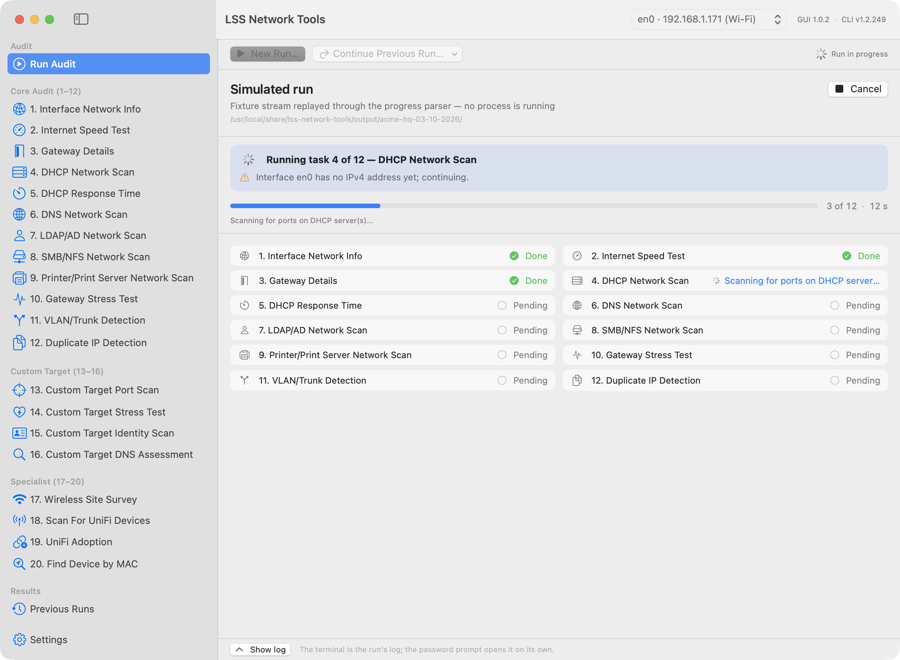
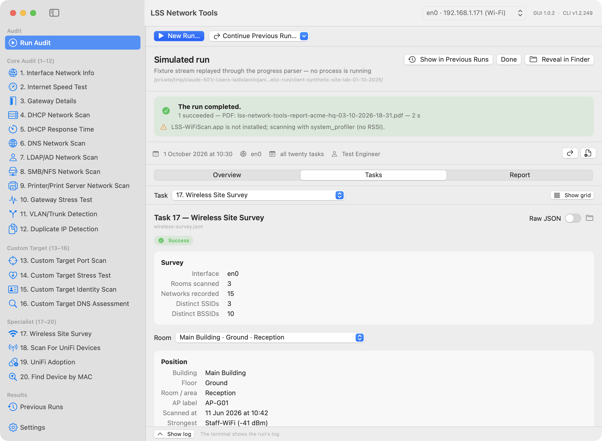
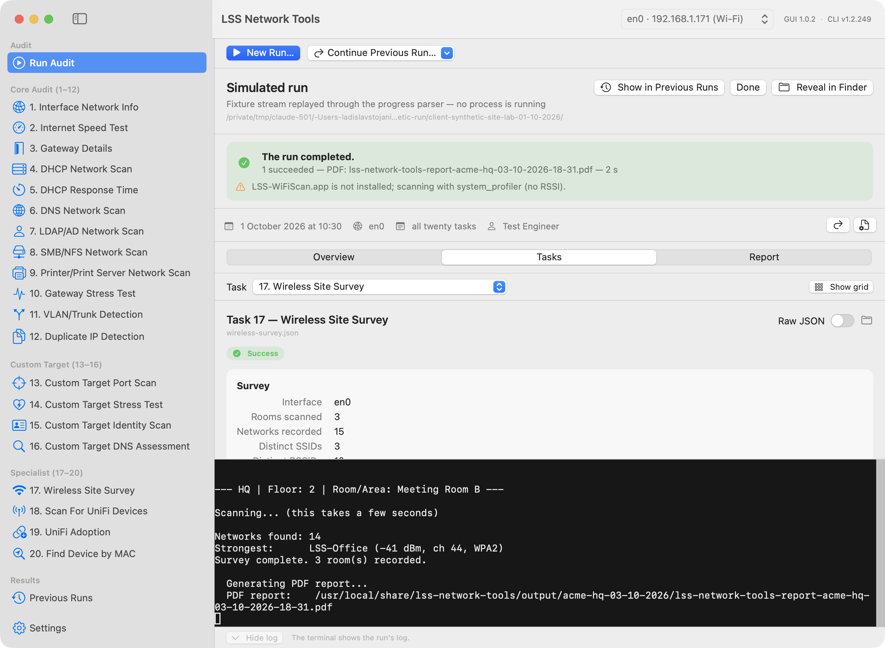

# LSS Network Tools — macOS app

A native SwiftUI front end (macOS 14+, Swift 6) for the `lss-network-tools` bash engine. The
bash script stays the engine: the app starts it in non-interactive mode, shows its progress
live, and browses the run directories it writes. Nothing is re-implemented in Swift.


## What it does

| Screen | What you get |
|---|---|
| **Run Audit / task screens** | "New Run…" opens a sheet: interface, client, location, note, prepared-by, full audit (tasks 1–12) or any selection, per-task inputs (target IP, MAC, wireless room, UniFi controller + SSH credentials). Stress tests (10, 14, full audit) ask for explicit confirmation before anything is queued. While the run is active the screen shows a phase banner, an overall progress bar ("3 of 12", elapsed time), the current stage and a per-task list; when the run finishes the same area shows the **results of that run** (findings overview, task grid, typed task views, report — the Previous Runs views) in place. The engine's text output is a log behind a **Show log** toggle, hidden by default; the pane opens itself when `sudo` asks for your password. |
| **Previous Runs** | Every run under the CLI's `output/`: overview tiles, findings table coloured by severity, remediation hints, a 20-cell task grid with typed views per task (tables, charts, key-value groups, raw JSON), the PDF or TXT report, Reveal in Finder, Continue Run, Rebuild Report, **Delete Run…** (header button and row context menu; the confirmation names the run and its directory; the deletion goes through the engine's `--delete-run`, since run directories belong to root). |
| **Interactive CLI** | The classic menu-driven session, on demand (Run Audit screen or the Terminal menu). |
| **Settings** | CLI location and version, interface, run defaults, interactive-CLI controls, privileges (SMAppService helper, authentication cadence), updates (Sparkle). |
| **Setup & Permissions** | One sheet (app menu, `--setup`, or automatically on the first launch of a build) that walks through everything the app needs once: command-line tool, privileged helper, administrator authentication, Location Services, Local Network. |

## Install on your Mac

This is a personal tool: it is built on the Mac that runs it and is **ad-hoc signed for good**
(no Apple Developer ID, no notarisation). Installing it is one command, run as your own user,
never with `sudo`:

```sh
cd macos && make install
```

`scripts/install-app.sh` does, in this order (every step prints at least one line prefixed
`install:`; the helper's own status output is indented under it). It refuses to start, and
refuses again right before quitting the app, while an audit or report build started from the
app is running (`lss-network-tools --run-task` / `--build-report`), because quitting the app
would abort that run — let it finish, or set `LSS_INSTALL_FORCE=1` to install anyway:

1. builds the **release** app (native architecture; `LSS_INSTALL_UNIVERSAL=1 make install` for a
   universal binary);
2. checks that whatever sits at `/Applications/LSS Network Tools.app` is ours (its
   `CFBundleIdentifier` must be `ie.lssolutions.lss-network-tools`) — anything else aborts the
   install and nothing is touched;
3. quits the running app if there is one (and stops if it is still running after that — a
   modal dialog or a password prompt can hold it; quit it yourself and run `make install` again);
4. **unregisters the privileged helper** from every copy it can find (the old `/Applications`
   copy and the build-dir copy) — launchd pins a registered helper to the cdhash of the app that
   registered it, and an ad-hoc cdhash changes with every build; a copy that predates the
   `--unregister-helper` flag (such as a 1.0.1 build installed before this change) is skipped
   and its registration is simply superseded — press Re-register in the Setup window if the
   helper then shows "enabled" but does not answer;
5. replaces the `/Applications` copy (`ditto`), registers it with LaunchServices, verifies the
   signature and **removes the build-dir copy**: Background Task Management records the helper's
   parent app by bundle identifier *and* path, and while a second bundle with our identifier
   exists in the build directory a registration from `/Applications` re-enables the old record
   (old path, old cdhash) and launchd refuses to spawn the helper (`OS_REASON_CODESIGNING`);
   `make build`, `make run` and `make screenshot` recreate the build-dir copy when they need it;
6. registers the helper again from the installed copy and checks that it answers; if it does not,
   one unregister/register cycle makes the record follow the new path — macOS may ask you to allow "LSS Network
   Tools" once more under System Settings → General → Login Items & Extensions → *Allow in the
   Background*;
7. compares the installed command-line tool (`lss-network-tools --version`) with the checkout's
   `APP_VERSION` and prints the exact `sudo ./install.sh` command when the CLI is missing or
   older (it never runs it — the CLI install is the only step that needs root);
8. opens the app with `--setup`, which shows the **Setup & Permissions** window.

The Setup window has one row per thing you grant once, each with its status and, where macOS has
a matching System Settings pane, a button that opens it:

| Row | What it covers |
|---|---|
| **Command-line tool** | Installed path and version, whether it supports non-interactive runs; Re-detect; the Terminal command to install or update it when needed. |
| **Privileged helper** | SMAppService status; Register, Open Login Items, Check Again, and **Re-register** for the rebuilt-app case (status "enabled" but the helper does not answer, or it speaks an older protocol version). |
| **Administrator authentication** | Whether the helper will need the macOS administrator dialog on this Mac (user-owned Homebrew → yes; root-owned tools → "not needed"); Authenticate now, Lock now; the "Ask for authentication" cadence and "Run tasks with" pickers. |
| **Location Services** | Needed by the Wi-Fi survey (CoreWLAN hides SSIDs without it); Request, Open Location Settings, Check Again. |
| **Local Network** | Requested for the app on macOS 15+ (whether the root scan processes are covered by this grant is unverified — see `docs/QUESTIONS.md`); macOS has no API to read this state, so the row shows when it was requested. Request (a 3-second Bonjour browse, which is what makes macOS show the prompt the first time), Open Privacy & Security (System Settings has no deep link to the Local Network list itself — pick it inside the pane). |

**Rules of thumb**

* **After every rebuild, run `make install` again** (or use Re-register in the Setup window /
  Settings → Privileges). A helper registered by a previous build is pinned to that build's
  cdhash and simply does not start for the new one (`launchctl print system/ie.lssolutions.lss-network-tools.helper`
  shows the `cdhash` it expects; the spawn fails with `EX_CONFIG`).
* Gatekeeper is not involved: a locally built app carries no quarantine attribute, so there is
  nothing to right-click → Open and nothing to notarise. Only an app copied from a DMG made on
  another Mac is quarantined — see below.
* The CLI's own startup menu has `6) Launch Graphical Interface` on macOS (v1.2.250): it opens
  `/Applications/LSS Network Tools.app` (or `~/Applications/…`) as the user who ran `sudo`, so
  the app keeps your settings, privacy grants and helper connection.

## Requirements

* macOS 14 or newer, Apple silicon or Intel.
* The command-line tool installed with `sudo ./install.sh` from the repository root (the app
  finds it through `/usr/local/share/lss-network-tools/install.env`). The app never bundles a
  copy of the script.
* To build: Xcode 26 or newer (or the matching Command Line Tools) with the **Metal toolchain**
  component (`xcodebuild -downloadComponent MetalToolchain`) — SwiftTerm ships a Metal shader.
* Nothing from the Apple Developer Program. A Developer ID, notarisation and Sparkle keys are
  **optional and unused** for the personal install: the build scripts sign ad-hoc and skip the
  rest cleanly (the hooks stay in place should the app ever be distributed).

## Build, run, test

Everything runs from the terminal; Xcode is never opened.

```sh
cd macos
make check-toolchain     # Swift, Metal toolchain, codesign
make build               # debug build → ~/Library/Caches/ie.lssolutions.lss-network-tools/build/app/LSS Network Tools.app
make run                 # build + launch
make install             # release build → /Applications, helper re-registered, Setup & Permissions window (see above)
make test                # Swift Testing: decoding of every fixture, parser, argument builder, validator, leak scan
make release             # universal release build
make screenshot VIEW=runs ARGS="--select-run 0 --tab tasks --task 5 --collapse-grid"
```

Build products live **outside the checkout** (`~/Library/Caches/ie.lssolutions.lss-network-tools/build`)
because a checkout under `~/Documents` is iCloud-synced and the file-provider extended attributes
break `codesign`. Override with `LSS_GUI_BUILD_DIR=/path make build`.

### Layout

```
macos/
  Package.swift                 SwiftPM: LSSCore, LSSXPC, LSSHelper, LSSNetworkTools, LSSCoreTests
  Sources/LSSCore               Foundation-only models, decoding, run loader, CLI contract (unit-tested)
  Sources/LSSXPC                XPC protocol shared by app and helper
  Sources/LSSHelper             privileged LaunchDaemon (SMAppService)
  Sources/LSSNetworkTools       the SwiftUI app (Setup/ holds the Setup & Permissions sheet)
  Tests/LSSCoreTests, Tests/Fixtures
  Resources/                    Info.plist template, daemon plist, entitlements
  scripts/                      build-app, install-app, sign, run-app, screenshot, make-dmg, notarize, release-appcast, lint, fixtures
  docs/                         PLAN, DECISIONS, QUESTIONS, research notes, screenshots
```

## How a run works

The app builds the engine's non-interactive argv (`--run-task …`, see the main README's
"Non-interactive mode") and runs `sudo /usr/local/bin/lss-network-tools …` on a pseudo-terminal
inside the app. You type your administrator password in the terminal pane; it never passes
through the app. The engine reports progress as `@@LSS {…}` lines, which drive the progress bar
and the task list; after each task the run browser refreshes. The Task 19 SSH password is handed
over only through the environment (`sudo --preserve-env=LSS_SSH_PASSWORD`), never as an argument.

**The terminal is a log, not the result.** During the run the Run Audit screen shows the phase
banner, an overall progress bar with "n of total" and the elapsed time, the current task's stage
and the per-task list. When the run finishes, the same area shows the results of the run that just
finished — the Previous Runs views (findings overview, task grid, typed task views, report) for
that run directory; a single task opens straight on its task view, a report rebuild on the report.
If nothing was written (launch failure, or a run that produced no output), the banner and task
list stay and "No results were written" is shown instead. The terminal pane is hidden by default
behind a thin **Show log / Hide log** bar (the setting is remembered); it opens itself while
`sudo` is waiting for the password — the only moment you must type into it — and returns to your
setting afterwards. The `@@LSS …` protocol lines are filtered out of the displayed text on both
routes (pty and helper); everything else the engine prints, including a `Password:` prompt
without a trailing newline, appears at once.





With the privileged helper registered **and selected** under Settings → Privileges → "Run tasks
with", runs go through an XPC LaunchDaemon instead of `sudo`. The helper only ever executes the
installed script named in `install.env` with an allow-listed argument grammar and serves
administrators only. Whether it asks for anything depends on who owns the engine's tools
(`nmap`, `jq`, `python3`, `tcpdump`, `speedtest-cli` and the directories on the way to them):

* **Root-owned tool chain** — runs start with no password at all.
* **User-owned tool chain** (the usual Homebrew install under `/opt/homebrew`) — before the run
  the standard macOS authentication dialog asks you to authenticate as an administrator (Touch
  ID where your Mac offers it). A root daemon must not execute user-owned binaries unattended,
  so this restores exactly the boundary `sudo` has: the same binaries run as root after you
  prove you are an administrator. How often you are asked is Settings → Privileges → "Ask for
  authentication": every run, every five minutes (the default, like sudo) or once per app
  session; "Lock now" discards the credential. The app never sees or stores your password — it
  holds an Authorization Services reference, and the helper (root) verifies it against rights it
  installs itself in the policy database.

Settings → Privileges and the Setup sheet show which case applies in one line — "Root-owned —
runs need no password" (green) or, in a neutral colour because it is the normal state of a
Homebrew Mac rather than a warning, "Homebrew tools under /opt/homebrew belong to your account —
runs ask for administrator authentication"; the validator's full sentence is in the tooltip and a
"Details" disclosure. Runs that need the engine's own Wi-Fi helper (Task 17 without a CoreWLAN
scan) always take the `sudo` route.

**Deleting a run** (Previous Runs → Delete Run…, or the run row's context menu) uses the same
machinery as Rebuild Report: after you confirm, the engine runs `--delete-run <run-dir>` on the
selected privilege route (helper or `sudo` in the pane), the header shows "Deleting…" and the
list refreshes when the directory is gone. The app never removes run directories itself — they
are created by the engine as root — and the engine refuses anything that is not a run directory
directly inside its output folder (no symlinks, never the output folder itself) before running the
same `rm -rf` as the interactive "000) Delete This Run".

## Signing, notarisation, release

None of this is needed for the personal install (`make install` above): the app is ad-hoc signed
for good and never distributed, so a Developer ID, notarisation and Sparkle keys are optional and
unused. The scripts keep every hook and skip cleanly without credentials. The one practical use of
the DMG is moving the app to **another Mac you own**: the copy from the image is quarantined, so
right-click → Open on the first launch, then run the Setup & Permissions window there too (the
helper registration and the privacy grants are per Mac).

| Step | Command | Without credentials |
|---|---|---|
| Sign | `CODESIGN_IDENTITY="Developer ID Application: …" make build` (or `make sign`) | ad-hoc signature, local use only |
| Package | `make dmg` → builds the universal **release** app, then `…/build/dist/LSS-Network-Tools-<version>.dmg` (refuses a debug app unless `LSS_DMG_ALLOW_DEBUG=1`; signs the image when an identity is set) | works (unsigned image) |
| Notarise | `NOTARY_KEYCHAIN_PROFILE=<profile> make notarize` — the profile comes from `xcrun notarytool store-credentials <profile> --apple-id … --team-id …` (passwords are never put on the command line) | prints one "skipped" line |
| Appcast | `SPARKLE_PRIVATE_KEY_FILE=~/.keys/sparkle make appcast` → `macos/appcast.xml` | prints one "skipped" line |

Sparkle updates are enabled only in builds made with `SPARKLE_PUBLIC_ED_KEY=<public key>`;
otherwise the "Check for Updates…" item is disabled and no network access happens. Build the
release you ship with that variable set: `generate_appcast` signs an enclosure only when the
archived app embeds the public key (the appcast script warns otherwise). `generate_appcast` is
taken from the checksum-verified SwiftPM Sparkle artifact (`swift package resolve`), never from
an ad-hoc download; `brew install --cask sparkle` is the alternative. `CFBundleVersion` is
derived from `macos/VERSION` (`major·1000000 + minor·1000 + patch`), so update ordering is
monotonic across branches. GUI releases
are tagged `macos-vX.Y.Z` (the CLI updater ignores them) with the DMG as the release asset; the
feed is the committed `macos/appcast.xml`.

## Troubleshooting

* **"the Metal toolchain is not installed"** — run `xcodebuild -downloadComponent MetalToolchain`
  (user-level download, no sudo).
* **codesign: "resource fork, Finder information, or similar detritus not allowed"** — the
  build directory is inside an iCloud-synced folder; use the default build dir or set
  `LSS_GUI_BUILD_DIR` to a non-synced location.
* **Screenshots are blank or `screencapture` fails** — the terminal running the scripts has no
  Screen Recording permission. `scripts/screenshot.sh` falls back to the app rendering itself
  (`--screenshot`), which needs no permission.
* **"Command-line tool not found"** — install it with `sudo ./install.sh` from the repository
  root, then Settings → Re-detect.
* **"The installed command-line tool (vX) does not support non-interactive runs"** — the app
  probes `lss-network-tools --run-task list` at every refresh; runs need v1.2.249 or newer. Update
  the CLI, then Settings → Re-detect. (Developers can point the app at a checkout with
  `defaults write ie.lssolutions.lss-network-tools cliAppRootOverride /path/to/checkout`.)
* **sudo asks for the password at every run** — expected on the pty path (sudo's timestamp is
  per terminal). Register the helper in Settings → Privileges: with a root-owned tool chain runs
  then start without any prompt; with the usual user-owned Homebrew install the standard macOS
  authentication dialog asks instead, as often as "Ask for authentication" says (every five
  minutes by default, like sudo; or every run / once per app session).
* **Helper "enabled" but it does not answer (after a rebuild)** — launchd still points at the
  previous build's cdhash (`launchctl print system/ie.lssolutions.lss-network-tools.helper`
  shows it; the spawn fails with `EX_CONFIG`). Run `make install` again, or press Re-register
  in Setup & Permissions / Settings → Privileges, then allow it in Login Items if asked.
* **Task 17 finds no networks from the app** — macOS needs Location permission for SSIDs;
  allow it when asked (Setup & Permissions → Location Services → Request), or enable it under
  System Settings → Privacy & Security → Location Services.
* **Scans started from the app find no hosts on macOS 15 or newer, while the same run works in
  Terminal** — check the Local Network permission first: Setup & Permissions → Local Network →
  Request shows the system prompt; if it was dismissed, allow the app under System Settings →
  Privacy & Security → Local Network.
* **Previous runs show "locked" tasks** — older CLI versions wrote stress-test JSON as 0600 root.
  Use "Repair file permissions" (needs the helper) or `sudo chmod 644 …/gateway-stress-test-device-*.json`.

## Development notes

* `docs/PLAN.md` is the approved design; `docs/DECISIONS.md` logs every non-obvious choice;
  `docs/QUESTIONS.md` lists decisions left to the project owner.
* Contracts between the bash engine, LSSCore and the app: `docs/research/05-m2-model-view-contract.md`,
  `06-m3-execution-contract.md`, `07-m4-privilege-updates-contract.md`.
* `make fixtures` regenerates the synthetic 20-task run and re-runs the plaintext-free leak scan;
  never commit `debug.txt`, `raw/`, TXT reports or an original PDF from a real run.
* `scripts/lint.sh` runs `bash -n`/shellcheck on the engine and the scripts and `swift package describe`.
